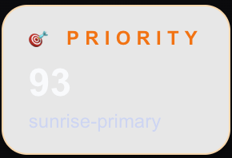

# Sunset Earth – Deep Orientation

Use this doc to brief AI coding partners (or new engineers) so they can jump directly to the relevant modules without rescanning the repository.

---

## 0. Quick Facts
| Item | Details |
| --- | --- |
| Stack | Next.js App Router (React/TypeScript) + Tailwind, deployed on Cloudflare Workers via OpenNext (`@opennextjs/cloudflare`) |
| Backend | Next.js API routes + Supabase Postgres (admin key via `lib/supabaseAdmin.ts`) |
| Cron Jobs | Cloudflare Cron Triggers (`wrangler.jsonc` + `worker.ts` scheduled handler): `/api/replace-link` hourly, `/api/weather-cache` every 3h, `/api/compute-rankings` every 5 min |
| Weather Source | Open-Meteo forecast API (cached in Supabase + memory) |
| Video Source | YouTube live streams stored in `camera_ytb` (`link_available`, `host_link` for refresh) |
| Real-time | Cloudflare Realtime Presence for rooms (`components/realtime-sidebar.tsx`) |

---

## 1. Mission & Narrative
- **Product:** A curated TV-like experience for watching the world’s best golden-hour live streams (sunrise/sunset, skyline views, scenic vistas).
- **Promise:** Always show a camera that is likely stunning *right now* based on weather, daylight, availability, and prior user rotation.
- **Users can:**
  1. Visit the homepage to immediately watch the top-ranked feed.
  2. Cycle through other high-quality cameras (localStorage tracks what’s “seen”).
  3. Spin up shared rooms with presence and optional voice integration.

---

## 2. Architecture Layers
1. **Presentation (Next.js, `app/` + `components/`)**
   - Server components fetch data (e.g., `app/page.tsx` fetches rankings) and pass to client islands like `CameraViewer`.
   - `components/camera-viewer.tsx` orchestrates iframe playback, metadata cards, rotation controls, and room actions.
2. **API Layer (`app/api/*`)**
   - Stateless endpoints running on Vercel Functions.
   - Key handlers listed in section 4.
3. **Domain Libraries (`lib/`)**
   - `cameras.ts` – Supabase queries and DTO mapping.
   - `weather.ts` – fetches weather, caches it, and computes camera scores with solar events.
   - `availability.ts` – heuristics for YouTube embed health.
   - `cameraRefresh.ts` – automatic link replacement and DB updates.
   - `rooms.ts` – CRUD helpers for collaborative rooms.
4. **Data & Infra (Supabase)**
   - Schema lives in `supabase/migrations/` (see section 5 for the most important tables).
   - Weather/sun caches plus ranking tables enable fast reads while expensive tasks run asynchronously.

---

## 3. Directory Cheat Sheet (Most-touched files)
| Path | Purpose |
| --- | --- |
| `app/page.tsx` | Entry point. Reads `camera_rankings` → picks best camera or random fallback. |
| `components/camera-viewer.tsx` | Main UI: iframe, metadata cards, rotation + room controls, localStorage state. |
| `app/api/best-camera/route.ts` | Returns `{ camera, meta, rotationReset }`. Reads rankings with secondary sorting, enforces freshness, handles exclusions. |
| `app/api/compute-rankings/route.ts` | Cron worker with task lock. Iterates `camera_ytb`, checks availability, fetches weather, calls `scoreCameraWeather`, and upserts `camera_rankings`. |
| `app/api/weather-cache/route.ts` | Cron worker with task lock. Fetches weather data for all cameras, triggers `compute-rankings` on completion. |
| `lib/weather.ts` | Weather fetch, caching, scoring, solar window detection. Emits `nextEvent` & `followingEvent` to avoid stale sun times. |
| `lib/task-lock.ts` | Distributed locking utilities (`acquireTaskLock`, `releaseTaskLock`, `withTaskLock`) for preventing race conditions. |
| `app/api/refresh-links` & `app/api/refresh-camera` | Periodic link validation & replacement via YouTube host channels. |
| `app/room/[roomId]/page.tsx` + `components/realtime-sidebar.tsx` | Shared watch experience and realtime presence integration. |
| `supabase/migrations/create_camera_rankings.sql` | Base schema for ranking table. |
| `supabase/migrations/20250312_add_task_locks.sql` | Task locks table for distributed locking. |
| `scripts/check-cameras.ts` / `scripts/run-replace.ts` | Local tooling for health checks and batch refresh. |

---

## 4. API Inventory
| Endpoint | Method | Description | Notes |
| --- | --- | --- | --- |
| `/api/best-camera` | GET | Returns the top ranked camera (minus exclusions). If `cameraId` is passed, returns metadata for that camera. | Requires `camera_rankings` freshness (`computed_at` within 24h). Falls back to random camera. |
| `/api/compute-rankings` | GET | Protected cron that recomputes scores/weather metadata for all cameras in batches of 50. | Runs every 5 minutes (and when triggered manually); consumes cached weather + availability flags to write `camera_rankings`. |
| `/api/weather-cache` | GET | Refreshes weather/sun caches for all cameras. | Runs every 3 hours (or manually) and pings `/api/compute-rankings` when done. |
| `/api/refresh-links` | GET | Hourly cron to revalidate cameras and mark `link_available`. | After finishing it triggers `/api/replace-link` then `/api/weather-cache` (which chains into `/api/compute-rankings`). |
| `/api/refresh-camera` | POST | Manual refresh for a single camera using `host_link` heuristics. | Body `{ cameraId }`. |
| `/api/check-camera` | POST | Client-side sanity check for a single embed before showing errors. | Body `{ camera }`; returns `{ available, reason }`. |
| `/api/create-room` | POST | Creates a room row tied to a camera/timezone. | Returns `{ roomId }`, used for shareable URLs. |
| `/api/rankings-status`/`rankings-health` | GET | Debug endpoints to inspect ranking freshness & counts. | Useful when cron stalls. |

(Other utility APIs exist, but the above cover 90% of workflows.)

---

## 5. Data Model Primer
### 5.1 `camera_ytb`
| Column | Description |
| --- | --- |
| `camera_id` (PK) | String/number id used everywhere. |
| `link` / `host_link` / `ytb_title` | Primary embed URL, channel feed, readable title. |
| `placename`, `city`, `country` | Display metadata. |
| `latitude`, `longitude`, `timezone` | Needed for weather + sun calculations. |
| `tag` | Category (e.g., City Skyline). Used to boost scoring. |
| `link_available` | User-verified availability flag; false cameras are skipped. |
| `sunset_delay`, `sunrise_advance` | Minutes to extend post-sunset or pre-sunrise golden windows for special cameras. |

### 5.2 `camera_rankings`
| Column | Description |
| --- | --- |
| `camera_id` | Foreign key to `camera_ytb`. |
| `score` | 0–100 composite derived from time-of-day tier + weather quality. |
| `label` | e.g., `sunset-primary`, `sunrise-extended`, `city-skyline-night`. |
| `distance_minutes` | Minutes from the peak golden window. |
| `is_clear`, `weather_class` | Quick bucket for UI (clear / partly cloudy / etc.). |
| `timezone`, `sunrise`, `sunset` | Derived from Open-Meteo. |
| `next_event_*`, `following_event_*` | Upcoming solar events (type + ISO time) so UI can always show a future event. |
| `available` | Mirrors availability heuristics from cron. |
| `computed_at` | Freshness gate; API requires data within last 24h. |

### 5.3 Weather & Sun Cache Tables
- `camera_weather_cache` / `camera_weather_history` – store last fetch JSON and append-only history.
- `camera_sun_cache` / `camera_sun_history` – track sunrise/sunset data per camera.

### 5.4 Rooms tables (see `lib/rooms.ts`)
| Column | Purpose |
| --- | --- |
| `room_id` | UUID returned to clients. |
| `camera_id` | Associated camera. |
| `room_start_time` / `room_end_time` | Timestamps for scheduling/closing. |
| `room_timezone` | Display + conversions. |
| `room_type` | Variation (sunset, sunrise, etc.). |
| `last_empty_at`, `is_close` | Presence-based auto-closing logic. |

### 5.5 Task Locks table (`task_locks`)
| Column | Purpose |
| --- | --- |
| `task_name` | Primary key; identifies the task (e.g., "weather-cache", "compute-rankings"). |
| `locked_at` | Timestamp when lock was acquired. |
| `locked_by` | Optional identifier of process holding the lock. |
| `expires_at` | TTL for automatic cleanup (default 10 minutes). Prevents deadlocks. |

**Purpose**: Distributed locking mechanism to prevent race conditions in cron jobs.
- `weather-cache` and `compute-rankings` both use task locks
- Prevents concurrent executions across serverless instances
- Auto-expiring locks prevent permanent deadlocks
- See `lib/task-lock.ts` for implementation

---

## 6. End-to-End Workflows
### 6.1 Pipeline Overview
1. **Stage A – Availability & Refresh (`/api/refresh-links` + `/api/replace-link`)**
   - `refresh-links` iterates through cameras, runs `isCameraAvailable`, flips `link_available`, marks reasons, and cleans empty rooms.
   - On success it immediately calls `/api/replace-link` to attempt repairing broken streams via `refreshCamera`.
2. **Stage B – Weather/Sun Harvest (`/api/weather-cache`)**
   - **Task Lock Protection**: Uses distributed lock (`task_locks` table) to prevent concurrent execution.
   - Iterates cameras (200/batch), calling `fetchWeatherSnapshot` to populate `camera_weather_cache`, `camera_weather_history`, `camera_sun_cache`, etc.
   - Runs via its own every-3-hour cron (or manual trigger) independent of refresh-links, and upon completion it pings `/api/compute-rankings` to start scoring.
3. **Stage C – Ranking Compute (`/api/compute-rankings`)**
   - **Race Condition Prevention**: Checks if `weather-cache` is still running; skips execution if locked to avoid stale data.
   - **Task Lock Protection**: Uses its own distributed lock to prevent concurrent ranking computation.
   - Runs automatically after weather-cache **and** via a standalone 5-minute cron so scores stay fresh between chained runs.
   - Uses latest `link_available` flags and cached weather snapshots.
   - **Consistent Data Handling**: All cameras get updated `computed_at` timestamp, including:
     - Unavailable cameras: `score=0, available=false`
     - Missing weather cache: `score=0, available=false`
     - Available cameras: Computed score via `scoreCameraWeather`
   - Scores via `scoreCameraWeather` (time tier × weather quality) and upserts `camera_rankings` with `next/following_event_*`, `label`, `weather_class`, etc.
   - **Secondary Sorting**: Rankings sorted by `score DESC, distance_minutes ASC` to break ties and prioritize cameras closer to golden hour.

### 6.2 Homepage Load → Camera Viewer
1. **`app/page.tsx`** runs on the server: queries `camera_rankings` for best available row (honouring optional exclusion set) via `supabaseAdmin`.
2. Falls back to `getRandomCamera()` if no fresh rankings exist.
3. Passes the chosen camera to `CameraViewer` as `initialCamera`.
4. **`CameraViewer`** (client):
   - Maintains `camera`, `cameraMeta`, `seen` arrays in localStorage.
   - Fetches `/api/best-camera?cameraId=...` to hydrate metadata (score, weather class, next/following events, timezone).
   - Renders UI cards with `describeWeather`, `describeTimeWindow`, and upcoming event info.
   - Provides “Next camera” which calls `/api/best-camera?exclude=ids...` and updates `seen` rotation.
   - Offers “Create room” action hitting `/api/create-room`.

### 6.3 Availability Recovery
1. `CameraViewer` listens for iframe errors and triggers `/api/check-camera` before showing fallback states.
2. Cron `/api/refresh-links` re-checks each camera hourly:
   - If the stream becomes available again, updates `camera_ytb.link_available=true`.
   - If unavailable, attempts `refreshCamera` to find alternate streams via `host_link` channel crawling.
   - Marks permanently unavailable cameras via `/api/camera-availability` helper.
3. Manual `/api/refresh-camera` can be called via scripts or admin UI.

### 6.4 Room Lifecycle
1. Client calls `/api/create-room` with `{ cameraId, timezone }`.
2. Server stores metadata and returns `roomId`.
3. `app/room/[roomId]/page.tsx` fetches room data + camera; displays the stream + share panel + realtime sidebar.
4. Browser clients connect to Cloudflare Realtime (see `components/realtime-sidebar.tsx` + `room-voice-panel.tsx`) to show viewer counts and optional audio rooms.
5. Cron logic monitors `last_empty_at` to auto-close and mark `is_close=true` when empty > 15 minutes.

---

## 7. External Services & Configuration Notes
- **Open-Meteo:** Endpoint `https://api.open-meteo.com/v1/forecast` with params `hourly=weathercode,cloudcover,...` and `daily=sunrise,sunset`. Always request `timezone=UTC`. Failures are retried twice; fallback uses cached response.
- **Supabase:** `supabaseAdmin` uses service role key via env var. Read/write heavy endpoints (compute rankings, refresh links) rely on it. Keep rate limits in mind when running scripts locally.
- **YouTube:** We embed using standard `https://www.youtube.com/embed/{id}?autoplay=1&mute=1`. Availability checks parse the embed HTML searching for known strings (e.g., “Playback on other websites has been disabled”).
- **Cloudflare Realtime Presence / Voice:** Rooms update presence counts via `/api/room-presence`; voice meetings tracked via `voice_meeting_id` (see `components/room-voice-panel.tsx`).
- **Environment Secrets** (set via `wrangler secret put` in production):
  - `SUPABASE_URL`, `SUPABASE_SERVICE_ROLE_KEY` (see `lib/supabaseAdmin.ts`)
  - `CRON_SECRET` (protects the cron/task API routes; sent as Bearer by `worker.ts`)
  - `SITE_URL` (public base URL; used for internal route-to-route calls & the cron handler)
  - Optional: `CLOUDFLARE_REALTIME_*` / `DAILY_*` for voice/presence.
  - See `.env.example` for the full list.

---

## 8. Operational Checklists
- **Before deploying schema changes:**
  1. Add migration SQL under `supabase/migrations/`.
  2. Update `supabase/migrations/create_camera_rankings.sql` if baseline should reflect new columns.
  3. Update affected API routes/libraries (`compute-rankings`, `best-camera`, UI types).
- **When rankings look stale (UI shows random cameras):**
  1. Hit `/api/rankings-health` to confirm counts & freshness.
  2. Re-run `/api/compute-rankings` with correct `CRON_SECRET`.
  3. Inspect Supabase logs for errors (availability/ weather fetch).
- **On camera failure reports:**
  1. Visit `/all-cameras` page to verify embed.
  2. Run `npm run ts-node scripts/check-cameras.ts` (if configured) for CLI check.
  3. Call `/api/refresh-camera` with `cameraId` to auto-fix if `host_link` is known.
- **Local dev tips:**
  - Mock weather responses if offline (extend `weatherCache` map or seed `camera_weather_cache`).
  - Many API routes expect Supabase credentials; use `.env.local` with service key.
  - Cron endpoints can be triggered manually via `curl -H "Authorization: Bearer $CRON_SECRET" https://.../api/compute-rankings`.

---

## 9. Context Seeding for AI Sessions
When starting a session with Codex/AI:
1. Reference sections relevant to the task (e.g., “Need to adjust ranking cron; see §6.1 + §5.2”).
2. Mention key files up front so the assistant can open them directly.
3. Call out active migrations or feature flags.
4. Keep this document updated whenever workflows or schemas change.

With this structure, assistants can load the mental model instantly and focus on the delta you need.
